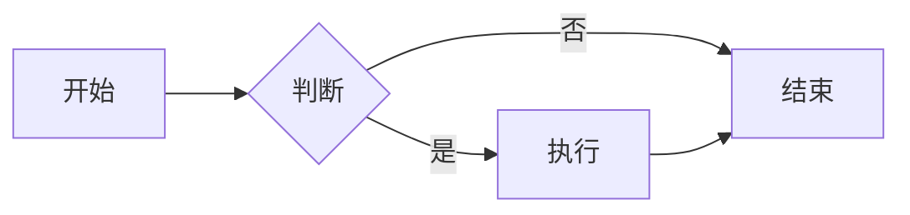
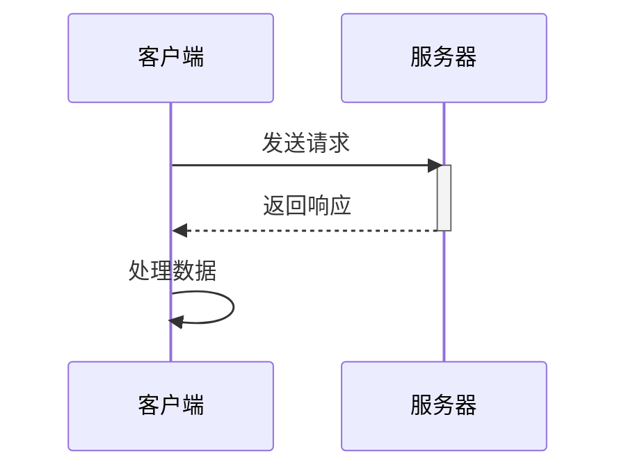
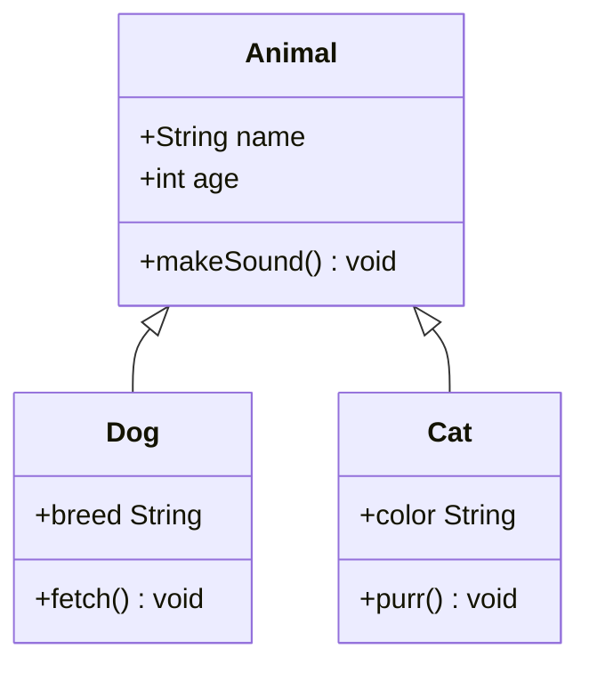
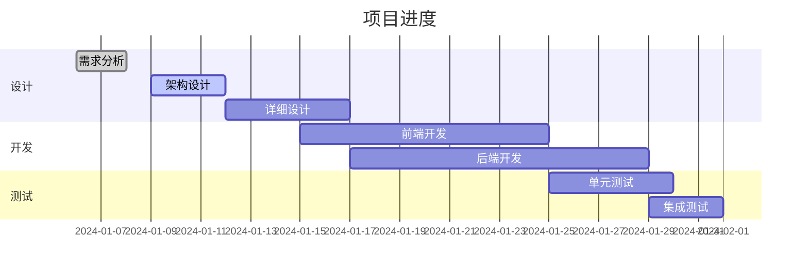
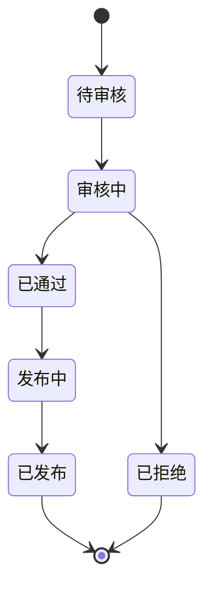
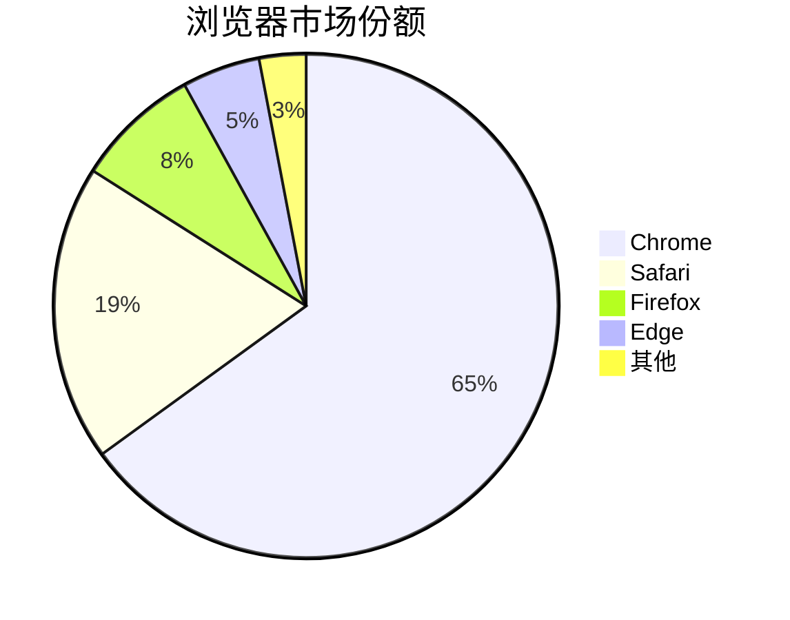
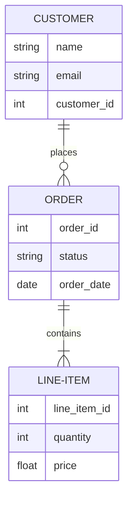
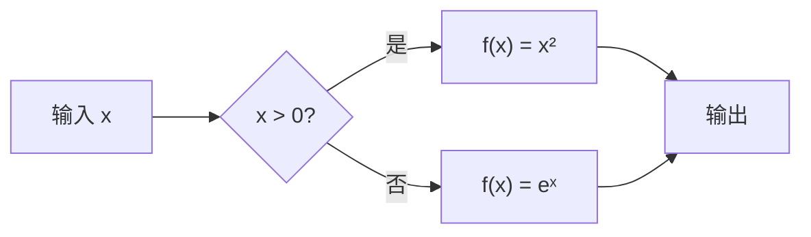

# Markdown 综合测试文件

## 1. 标题与段落
### 1.1 一级标题
#### 1.2 二级标题
这是一个段落，包含**加粗**、*斜体*、~~删除线~~和`行内代码`。

## 2. 列表
### 2.1 无序列表
- 项目一
- 项目二
  - 子项目二
### 2.2 有序列表
1. 第一项
2. 第二项

## 3. Mermaid 图表
### 3.1 流程图


### 3.2 时序图


### 3.3 类图


### 3.4 甘特图


### 3.5 状态图


### 3.6 饼图


### 3.7 实体关系图


---

## 4. HTML 混合内容
<div style="border:1px solid #ccc; padding:10px; margin:10px 0;">
    <p style="color:red;">这是HTML嵌入的红色段落</p>
    <table border="1">
        <tr><th>HTML表头</th><th>值</th></tr>
        <tr><td>A</td><td>1</td></tr>
    </table>
</div>

<details>
<summary>点击展开详情</summary>
这里是折叠内容，支持Markdown语法：
- 列表项1
- 列表项2
</details>

---

## 5. 特殊符号与Emoji
© ® ™ € £ ¥ ± × ÷ ≠ ≤ ≥ ∞ ∂ √ ∑ ∏ ∫ ∆ ∇

😀 🎉 🚀 ❤️ ✅ ⚠️ 🔥 💡 📝

---

## 6. 综合复杂示例

### 6.1 嵌套结构

> **注意：** 引用内部可以包含多种元素：
>
> ```python
> def nested_example():
>     pass
> ```
>
> - 列表项
> - 另一项
>
> | 列1 | 列2 |
> |-----|-----|
> | 数据 | 数据 |

### 6.2 带公式的流程图（已修正为标准Mermaid语法）



---

**测试完成！**
